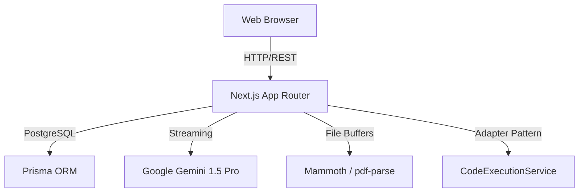

# System Architecture

InterviewIQ AI relies on a modern serverless edge architecture powered by Next.js and the Vercel AI SDK.

## High-Level Flow

## Modular Services
To maintain enterprise-grade separation of concerns, the API routes act strictly as thin controllers. All logic is pushed into the `src/lib/services/` layer:
- `AIResumeService`
- `AICodeReviewerService`
- `CodeExecutionService` (Mock, Judge0, Docker placeholders)
