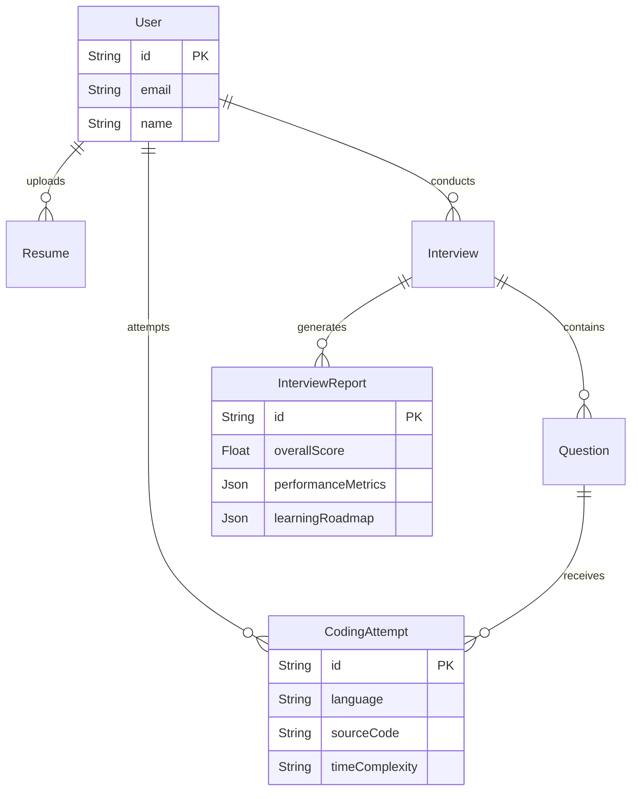

# Database Schema

InterviewIQ AI uses Prisma ORM with PostgreSQL. The schema is highly relational and optimized with indexing for analytical queries.

## Entity-Relationship Diagram

```mermaid
erDiagram
  User ||--o{ Resume : "uploads"
  User ||--o{ Interview : "conducts"
  User ||--o{ CodingAttempt : "attempts"
  Interview ||--o{ Question : "contains"
  Interview ||--o{ InterviewReport : "generates"
  Question ||--o{ CodingAttempt : "receives"
  
  User {
    String id PK
    String email
    String name
  }
  InterviewReport {
    String id PK
    Float overallScore
    Json performanceMetrics
    Json learningRoadmap
  }
  CodingAttempt {
    String id PK
    String language
    String sourceCode
    String timeComplexity
  }
```
